# DOCUMENT DE SYNTHÈSE - SOLUTION ENTRIX
*Plateforme de Gestion d'Événements et Contrôle d'Accès*

---

**Version :** 1.0  
**Date :** Juillet 2025  
**Destinataire :** Équipe Projet (Développement, MOA, Direction)  
**Classification :** Document Technique Interne

---

## 🎯 RÉSUMÉ EXÉCUTIF

**Entrix** est une solution complète de gestion d'événements sportifs et culturels avec contrôle d'accès intégré. La plateforme digitalise entièrement la chaîne de billetterie, des abonnements et du contrôle physique d'accès, tout en offrant une traçabilité complète et des outils d'analyse avancés.

### Objectifs Business
- **Digitalisation complète** de la billetterie et du contrôle d'accès
- **Augmentation des revenus** par l'optimisation des ventes en ligne
- **Sécurisation des accès** avec traçabilité complète
- **Amélioration de l'expérience fan** avec interface moderne
- **Reporting temps réel** pour les autorités et la direction

---

## 🏗️ ARCHITECTURE GLOBALE DE LA SOLUTION

### Vue d'Ensemble Architecturale

Entrix s'articule autour de **7 modules principaux** interconnectés formant un écosystème intégré :

```
┌─────────────────┐    ┌─────────────────┐    ┌─────────────────┐
│  UTILISATEURS   │◄──►│   ÉVÉNEMENTS    │◄──►│     VENUES      │
│   & GROUPES     │    │                 │    │ & CARTOGRAPHIE  │
└─────────────────┘    └─────────────────┘    └─────────────────┘
         ▲                       ▲                       ▲
         │                       │                       │
         ▼                       ▼                       ▼
┌─────────────────┐    ┌─────────────────┐    ┌─────────────────┐
│   BILLETTERIE   │◄──►│    PAIEMENTS    │◄──►│   SÉCURITÉ &    │
│  & CONTRÔLE     │    │   & BILLING     │    │     AUDIT       │
│     D'ACCÈS     │    │                 │    │                 │
└─────────────────┘    └─────────────────┘    └─────────────────┘
                                │
                                ▼
                       ┌─────────────────┐
                       │   REPORTING &   │
                       │   ANALYTICS     │
                       └─────────────────┘
```

### Principes Architecturaux Clés

1. **Modularité** : Chaque module est autonome avec des interfaces définies
2. **Scalabilité** : Architecture supportant la montée en charge
3. **Flexibilité** : Configuration adaptable aux différents types d'événements
4. **Traçabilité** : Audit complet de toutes les opérations critiques
5. **Sécurité** : Authentification renforcée et contrôle d'accès granulaire

---

## 📦 MODULES ET FONCTIONNALITÉS DÉTAILLÉES

### 🔐 Module 1 : Utilisateurs & Groupes

**Responsabilité :** Gestion centralisée des utilisateurs, rôles et permissions

#### Fonctionnalités Principales
- **Gestion des utilisateurs** : Inscription, profils détaillés, authentification
- **Système de rôles hiérarchiques** : USER → BADGECHECKER → ADMIN → SUPERADMIN
- **Groupes spécialisés** : Segmentation marketing, contrôle d'accès, zones géographiques
- **Profils enrichis** : Démographie, préférences, historique de fréquentation

#### Cas d'Usage Métier
- Attribution automatique de rôles selon le type d'achat
- Segmentation marketing pour campagnes ciblées
- Contrôle d'accès granulaire selon l'appartenance aux groupes
- Historique complet pour analytics et fidélisation

---

### 🎪 Module 2 : Événements

**Responsabilité :** Gestion flexible des événements sportifs et culturels

#### Fonctionnalités Principales
- **Référentiel participants** : Équipes, artistes, speakers avec historique complet
- **Gestion d'événements** : Création, planification, métadonnées riches
- **Groupes d'événements** : Saisons sportives, tournois, festivals
- **Relations complexes** : Rivalités, partenariats, affiliations entre participants

#### Architecture Flexible
- **Multi-types** : Football, basketball, concerts, conférences
- **Métadonnées JSON** : Adaptation aux spécificités de chaque type d'événement
- **Hiérarchie** : Saison → Groupe → Événement individuel
- **Temporalité** : Gestion complète des dates, reports, annulations

---

### 🏟️ Module 3 : Venues & Cartographie

**Responsabilité :** Gestion des lieux avec configurations multiples

#### Concept Révolutionnaire : Cartographies Multiples
Un même lieu physique peut avoir plusieurs configurations :
- **Configuration Football** : 45 000 places, tribunes traditionnelles
- **Configuration Concert** : 40 000 places, fosse + gradins
- **Configuration Conférence** : 5 000 places, amphithéâtre

#### Fonctionnalités Principales
- **Gestion des venues** : Informations générales, coordonnées GPS, capacités
- **Cartographies multiples** : Différentes configurations selon l'usage
- **Zones hiérarchiques** : Organisation en niveaux (tribunes → secteurs → rangées)
- **Places individuelles** : Numérotation précise avec coordonnées
- **Points d'accès** : Configuration des entrées/sorties par cartographie
- **Amenities** : Services disponibles (parking, restauration, wifi)

Amenities are now stored as part of the metadata field in venue_zones or venue_mappings, not as a separate table.

---

### 🎫 Module 4 : Billetterie & Contrôle d'Accès

**Responsabilité :** Gestion unifiée de la billetterie et du contrôle physique

#### Architecture Centrale : Table `access_rights`
Toutes les formes d'accès (billets, abonnements) convergent vers une table unique `access_rights` qui génère les QR codes et gère les validations.

#### Fonctionnalités Principales
- **Plans d'abonnements** : Définition de catalogues flexibles
- **Billetterie événementielle** : Vente de billets individuels
- **Pricing dynamique** : Règles de prix avancées (early bird, groupes, VIP)
- **Transferts sécurisés** : Revente/transfert entre utilisateurs
- **Contrôle d'accès temps réel** : Validation QR avec logs complets
- **Blacklist intégrée** : Système de sécurité multi-niveaux

#### Flux Opérationnels
1. **Achat** : User → Sélection → Configuration prix → Paiement → Génération QR
2. **Contrôle** : Scan QR → Vérifications → Validation/Refus → Log audit
3. **Transfert** : Initiation → Vérifications → Nouveau QR → Ancien invalidé

---

### 💳 Module 5 : Paiements & Billing

**Responsabilité :** Gestion des transactions et de la facturation

#### Intégration Flouci (Solution de Paiement Tunisienne)
- **Paiement mobile** : Portefeuille électronique Flouci
- **Webhooks temps réel** : Synchronisation automatique des statuts
- **Gestion des échecs** : Retry automatique et gestion des erreurs
- **Multi-devises** : Support TND avec extension possible

#### Fonctionnalités Avancées
- **Commissions clubs** : Calcul automatique selon contrats (fixe/pourcentage/étagé)
- **Remboursements** : Processus automatisés avec validation
- **Tentatives de paiement** : Tracking complet pour analytics
- **Facturation** : Génération automatique avec conformité comptable

---

### 🛡️ Module 6 : Sécurité & Audit

**Responsabilité :** Protection et traçabilité complète du système

#### Audit Centralisé
- **Journal complet** : Toutes les actions critiques enregistrées
- **Niveaux de sévérité** : Classification des événements de sécurité
- **Retention configurable** : Archivage selon les exigences légales

#### Authentification Renforcée
- **Sessions sécurisées** : Gestion avec expiration automatique
- **MFA (Multi-Factor Authentication)** : SMS, Email, TOTP, App Push
- **Rate limiting** : Protection contre les attaques par déni de service
- **Détection d'anomalies** : Patterns suspects, géolocalisation inhabituelle

#### Monitoring Proactif
- **Alertes temps réel** : Événements de sécurité critiques
- **Politiques personnalisables** : Configuration selon les besoins
- **Conformité** : RGPD et réglementations locales

---

### 📊 Module 7 : Reporting & Analytics

**Responsabilité :** Business Intelligence et aide à la décision

#### Dashboards Temps Réel
- **Monitoring live** : Flux d'entrée, capacité, incidents
- **KPIs commerciaux** : Ventes, revenus, taux de conversion
- **Analytics démographiques** : Profil des supporters, habitudes
- **Reporting sécuritaire** : Interface dédiée pour les autorités

#### Exports et Intégrations
- **Formats multiples** : Excel, PDF, CSV, JSON
- **APIs RESTful** : Intégration avec systèmes tiers
- **Historiques complets** : Données de fréquentation par saison

---

## 🗃️ SCHÉMA DE DONNÉES GLOBAL

### Entités Principales et Relations

```
USERS ──┬─ USER_ROLES ──── ROLES
        ├─ USER_GROUPS ─── GROUPS
        ├─ SUBSCRIPTIONS
        ├─ TICKETS
        └─ ACCESS_RIGHTS

EVENTS ─┬─ EVENT_PARTICIPANTS ─── PARTICIPANTS
        ├─ EVENT_GROUPS
        ├─ EVENT_CATEGORIES  
        ├─ EVENT_TICKET_CONFIG
        └─ ACCESS_RIGHTS

VENUES ─┬─ VENUE_MAPPINGS ─┬─ VENUE_ZONES ─── SEATS
        │                  ├─ ACCESS_POINTS
        │                  
        └─ VENUE_MEDIA

ORDERS ─┬─ ORDER_ITEMS
        └─ PAYMENTS ─┬─ PAYMENT_WEBHOOKS
                     └─ CLUB_COMMISSIONS

ACCESS_RIGHTS ─┬─ ACCESS_CONTROL_LOG
               └─ ACCESS_TRANSACTIONS_LOG

AUDIT_LOGS ─── USER_SESSIONS ─── SECURITY_EVENTS
```

### Relations Critiques

#### 1. **Users ↔ Access Rights** (1:N)
- Un utilisateur peut avoir plusieurs droits d'accès (billets + abonnements)
- Chaque droit d'accès est lié à un utilisateur unique

#### 2. **Events ↔ Access Rights** (1:N)  
- Un événement génère de multiples droits d'accès
- Chaque droit d'accès est valide pour un événement spécifique

#### 3. **Venues ↔ Events** (1:N via Mappings)
- Un venue peut accueillir plusieurs événements
- Chaque événement utilise une cartographie spécifique du venue

#### 4. **Participants ↔ Events** (N:N via Event_Participants)
- Les participants peuvent participer à plusieurs événements
- Un événement peut avoir plusieurs participants avec des rôles définis

#### 5. **Orders ↔ Payments** (1:N)
- Une commande peut avoir plusieurs tentatives de paiement
- Gestion des échecs et retry automatique

---

## 🔗 INTERACTIONS ENTRE MODULES

### Flux Transversaux Principaux

#### 1. **Flux d'Achat Complet**
```
Événement créé → Configuration billetterie → User sélectionne → 
Pricing calculé → Commande créée → Paiement Flouci → 
Webhook reçu → Access Rights générés → QR Code envoyé → 
Commission club calculée → Audit enregistré
```

#### 2. **Flux de Contrôle d'Accès**
```
QR scanné → Vérification Access Rights → Check venue/zone → 
Validation blacklist → Contrôle capacité → Décision → 
Log audit → Action physique (ouverture/refus) → 
Analytics temps réel → Rapport sécurité
```

#### 3. **Flux de Transfert de Billet**
```
User initie transfert → Vérification éligibilité → 
Validation destinataire → Nouveau Access Right créé → 
Ancien invalidé → Transaction loggée → 
Notifications envoyées → Audit complet
```

### Dépendances Critiques

- **Billetterie** dépend de **Événements** (configuration des types de billets)
- **Contrôle d'Accès** dépend de **Venues** (zones autorisées) et **Billetterie** (droits valides)
- **Paiements** dépend de **Billetterie** (montants) et alimentent **Analytics** 
- **Sécurité** surveille tous les modules et génère des alertes transversales

---

## 📊 DIAGRAMME ERD DE LA BASE DE DONNÉES

### Code Graphviz pour Visualisation ERD

```dot
digraph EntrixERD {
    rankdir=TB;
    node [shape=record, style=filled, fillcolor=lightblue];
    
    // Module Users & Groups (Vert)
    users [fillcolor=lightgreen, label="{USERS|id (PK)\\lusername\\lemail\\lpassword\\lfirst_name\\llast_name\\lphone\\lstatus}"];
    user_profiles [fillcolor=lightgreen, label="{USER_PROFILES|id (PK)\\luser_id (FK)\\ldate_of_birth\\lgender\\lcity\\lpreferences}"];
    roles [fillcolor=lightgreen, label="{ROLES|id (PK)\\lcode\\lname\\llevel\\lis_active}"];
    groups [fillcolor=lightgreen, label="{GROUPS|id (PK)\\lcode\\lname\\ltype\\lmetadata}"];
    user_roles [fillcolor=lightgreen, label="{USER_ROLES|id (PK)\\luser_id (FK)\\lrole_id (FK)\\lassigned_at}"];
    user_groups [fillcolor=lightgreen, label="{USER_GROUPS|id (PK)\\luser_id (FK)\\lgroup_id (FK)\\lmetadata}"];
    
    // Module Events (Beige)
    participants [fillcolor=wheat, label="{PARTICIPANTS|id (PK)\\lcode\\lname\\ltype\\lcategory\\lnationality\\llogo_url}"];
    event_groups [fillcolor=wheat, label="{EVENT_GROUPS|id (PK)\\lcode\\lname\\ltype\\lstart_date\\lend_date}"];
    events [fillcolor=wheat, label="{EVENTS|id (PK)\\lcode\\lname\\levent_group_id (FK)\\lvenue_id (FK)\\lstart_datetime}"];
    event_participants [fillcolor=wheat, label="{EVENT_PARTICIPANTS|id (PK)\\levent_id (FK)\\lparticipant_id (FK)\\lrole}"];
    
    // Module Venues (Jaune)
    venues [fillcolor=lightyellow, label="{VENUES|id (PK)\\lname\\lslug\\laddress\\lcity\\lmax_capacity\\llatitude\\llongitude}"];
    venue_mappings [fillcolor=lightyellow, label="{VENUE_MAPPINGS|id (PK)\\lvenue_id (FK)\\lname\\leffective_capacity\\lvalid_from}"];
    venue_zones [fillcolor=lightyellow, label="{VENUE_ZONES|id (PK)\\lmapping_id (FK)\\lparent_zone_id (FK)\\lname\\lcapacity}"];
    seats [fillcolor=lightyellow, label="{SEATS|id (PK)\\lzone_id (FK)\\lreference\\lrow_name\\lnumber\\lstatus}"];
    access_points [fillcolor=lightyellow, label="{ACCESS_POINTS|id (PK)\\lmapping_id (FK)\\lname\\laccess_type\\lallowed_zones}"];
    
    // Module Billetterie - CENTRAL (Rose/Rouge)
    subscription_plans [fillcolor=lightcoral, label="{SUBSCRIPTION_PLANS|id (PK)\\lcode\\lname\\levent_group_id (FK)\\lprice\\lmax_events}"];
    subscriptions [fillcolor=lightcoral, label="{SUBSCRIPTIONS|id (PK)\\luser_id (FK)\\lplan_id (FK)\\lstatus\\lstart_date}"];
    tickets [fillcolor=lightcoral, label="{TICKETS|id (PK)\\luser_id (FK)\\levent_id (FK)\\lticket_type_id (FK)\\lstatus}"];
    access_rights [fillcolor=red, fontcolor=white, label="{⭐ ACCESS_RIGHTS ⭐|id (PK)\\luser_id (FK)\\levent_id (FK)\\lqr_code\\lvalid_from\\lvalid_until\\lstatus\\lzone_allowed}"];
    
    // Module Paiements (Bleu)
    orders [fillcolor=lightsteelblue, label="{ORDERS|id (PK)\\luser_id (FK)\\lorder_number\\ltotal_amount\\lstatus\\lcreated_at}"];
    payments [fillcolor=lightsteelblue, label="{PAYMENTS|id (PK)\\lorder_id (FK)\\lpayment_number\\lamount\\lstatus\\lexternal_transaction_id}"];
    payment_webhooks [fillcolor=lightsteelblue, label="{PAYMENT_WEBHOOKS|id (PK)\\lpayment_id (FK)\\lwebhook_id\\levent_type\\lstatus}"];
    club_commissions [fillcolor=lightsteelblue, label="{CLUB_COMMISSIONS|id (PK)\\lpayment_id (FK)\\lclub_id\\lcommission_amount\\lnet_to_club}"];
    
    // Module Sécurité & Audit (Violet)
    audit_logs [fillcolor=plum, label="{AUDIT_LOGS|id (PK)\\laction\\lentity_type\\lentity_id\\luser_id (FK)\\lip_address\\lcreated_at}"];
    user_sessions [fillcolor=plum, label="{USER_SESSIONS|id (PK)\\luser_id (FK)\\lsession_token\\lip_address\\lexpires_at}"];
    access_control_log [fillcolor=plum, label="{ACCESS_CONTROL_LOG|id (PK)\\laccess_right_id (FK)\\laction\\lstatus\\lscanned_at}"];
    
    // Relations principales - ACCESS_RIGHTS au centre
    users -> access_rights [label="1:N", color=red, penwidth=3];
    events -> access_rights [label="1:N", color=red, penwidth=3];
    subscriptions -> access_rights [label="1:N", style=dashed, color=red];
    tickets -> access_rights [label="1:N", style=dashed, color=red];
    
    // Relations Users Module
    users -> user_profiles [label="1:1"];
    users -> user_roles [label="1:N"];
    users -> user_groups [label="1:N"];
    roles -> user_roles [label="1:N"];
    groups -> user_groups [label="1:N"];
    
    // Relations Events Module
    event_groups -> events [label="1:N"];
    events -> event_participants [label="1:N"];
    participants -> event_participants [label="1:N"];
    
    // Relations Venues Module
    venues -> venue_mappings [label="1:N"];
    venue_mappings -> venue_zones [label="1:N"];
    venue_zones -> venue_zones [label="1:N", style=dashed, label="parent"];
    venue_zones -> seats [label="1:N"];
    venue_mappings -> access_points [label="1:N"];
    
    // Relations Billetterie
    event_groups -> subscription_plans [label="1:N"];
    subscription_plans -> subscriptions [label="1:N"];
    users -> subscriptions [label="1:N"];
    users -> tickets [label="1:N"];
    events -> tickets [label="1:N"];
    
    // Relations Paiements
    users -> orders [label="1:N"];
    orders -> payments [label="1:N"];
    payments -> payment_webhooks [label="1:N"];
    payments -> club_commissions [label="1:1"];
    
    // Relations Audit
    users -> audit_logs [label="1:N"];
    users -> user_sessions [label="1:N"];
    access_rights -> access_control_log [label="1:N"];
    
    // Relations transversales
    venues -> events [label="1:N", style=dotted];
    venue_mappings -> events [label="1:N", style=dotted];
}
```



**Instructions de visualisation :**
1. Copier le code DOT ci-dessus
2. Utiliser [Graphviz Online](https://dreampuf.github.io/GraphvizOnline/) ou [draw.io](https://app.diagrams.net/)  
3. Coller le code dans l'éditeur DOT/Graphviz
4. La table **ACCESS_RIGHTS** (en rouge) est le cœur du système

## 🗄️ MODÈLE DE DONNÉES DÉTAILLÉ

### Tables Centrales et Leur Utilité

#### **Core Business Tables**

| Table | Utilité | Cardinalité Typique |
|-------|---------|-------------------|
| `users` | Identités et authentification | 50k+ utilisateurs |
| `events` | Événements organisés | 200+ événements/saison |
| `venues` | Lieux physiques | 5-10 stades/salles |
| `access_rights` | ⭐ **TABLE PIVOT** - Tous les accès | 100k+ QR codes/saison |
| `payments` | Transactions financières | 50k+ paiements/saison |
| `audit_logs` | Traçabilité complète | Millions d'entrées |

#### **Configuration Tables**

| Table | Utilité | Gestion |
|-------|---------|---------|
| `subscription_plans` | Catalogues d'abonnements | Configuration administrative |
| `ticket_types` | Types de billets disponibles | Configuration par événement |
| `venue_mappings` | Configurations des lieux | Setup par type d'événement |
| `pricing_rules` | Règles de tarification | Configuration business |
| `security_policies` | Règles de sécurité | Configuration système |

#### **Operational Tables**

| Table | Utilité | Volume |
|-------|---------|--------|
| `access_control_log` | Logs des scans QR | Très élevé (temps réel) |
| `payment_webhooks` | Synchronisation Flouci | Élevé (chaque paiement) |
| `user_sessions` | Sessions actives | Modéré (connectés) |
| `rate_limiting` | Protection anti-abus | Élevé (toutes requêtes) |

### Relations de Données Complexes

#### **1. Hiérarchie des Venues**
```
VENUE (Stade Olympique)
  └── MAPPING (Configuration Football)
      └── ZONE (Tribune Principale)
          ├── ZONE (Secteur A)
          │   └── SEATS (Places A1-A200)
          └── ZONE (Secteur B)
              └── SEATS (Places B1-B200)
```

#### **2. Hiérarchie des Événements**  
```
EVENT_GROUP (Saison 2024-25)
  ├── EVENT (CA vs EST - Journée 1)
  ├── EVENT (CA vs CSS - Journée 2)
  └── EVENT (CA vs ST - Journée 3)
```

#### **3. Cascade Access Rights**
```
SUBSCRIPTION (Abonné Saison)
  ├── ACCESS_RIGHT (Match 1 - QR: ABC123)
  ├── ACCESS_RIGHT (Match 2 - QR: DEF456)  
  └── ACCESS_RIGHT (Match 3 - QR: GHI789)

TICKET (Billet individuel)
  └── ACCESS_RIGHT (Match unique - QR: JKL012)
```

---

## 📱 INTERFACES ET APPLICATIONS

### Architecture Multi-Interface

#### **1. Interface Web Administrative**
- **Cible** : Personnel du club, administrateurs
- **Fonctions** : Configuration complète, reporting, gestion
- **Technologies** : React.js, dashboard temps réel

#### **2. Interface Web Public**  
- **Cible** : Supporters, acheteurs
- **Fonctions** : Achat billets, gestion compte, transferts
- **Technologies** : Interface responsive, optimisée mobile

#### **3. Application Mobile Android**
- **Cible** : Contrôleurs d'accès
- **Fonctions** : Scan QR, validation accès, mode offline
- **Technologies** : Native Android, synchronisation temps réel

#### **4. Dashboard Autorités**
- **Cible** : Forces de sécurité, préfecture
- **Fonctions** : Monitoring live, alertes, reporting sécuritaire
- **Technologies** : Interface dédiée sécurisée

### APIs et Intégrations

#### **APIs RESTful**
- **Endpoints** : Billetterie, contrôle d'accès, analytics
- **Authentification** : JWT tokens, OAuth2
- **Rate limiting** : Protection contre les abus
- **Documentation** : Swagger/OpenAPI

#### **Webhooks Entrants/Sortants**
- **Flouci** : Notifications de paiement temps réel
- **Systèmes tiers** : ERP, CRM, comptabilité
- **Notifications** : Email, SMS, push mobile

---

## 🔧 ASPECTS TECHNIQUES

### Stack Technologique

#### **Backend**
- **Runtime** : Node.js avec NestJS (TypeScript)
- **Base de données** : PostgreSQL avec optimisations
- **Cache** : Redis pour performances
- **ORM** : Prisma pour la gestion des données

#### **Frontend**
- **Framework** : React.js avec TypeScript
- **State Management** : Redux/Context API
- **UI Framework** : Material-UI ou Tailwind CSS
- **Build** : Webpack/Vite avec optimisations

#### **Infrastructure**
- **Containerisation** : Docker avec orchestration
- **Déploiement** : CI/CD automatisé
- **Monitoring** : Logs centralisés, métriques temps réel
- **Sauvegarde** : Backups automatisés chiffrés

### Performances et Scalabilité

#### **Optimisations Database**
- **Indexation** : Indexes composites sur les requêtes fréquentes
- **Partitioning** : Tables de logs partitionnées par date
- **Connection pooling** : Gestion optimale des connexions
- **Read replicas** : Séparation lecture/écriture

#### **Cache Strategy**
- **Redis** : Cache des sessions, données fréquentes
- **CDN** : Assets statiques, images des venues
- **API caching** : Responses cachées avec TTL adaptatif

---

## 🎯 CAS D'USAGE MÉTIER AVANCÉS

### Scenario 1 : Derby CA vs EST

#### **Contraintes Spéciales**
- Séparation des supporters adverse
- Sécurité renforcée
- Contrôle d'accès strict par zones

#### **Configuration Système**
```
1. EVENT créé avec metadata {"rivalry": "high", "security_level": "maximum"}
2. ZONE_MAPPING_OVERRIDES définies pour séparation supporters
3. BLACKLIST activée avec historique incidents
4. PRICING_RULES spéciales (tarifs préférentiels résidents)
5. ACCESS_POINTS configurés avec contrôles renforcés
```

#### **Flux Opérationnel**
- **J-30** : Ouverture billetterie avec restrictions géographiques
- **J-7** : Activation blacklist renforcée
- **J-1** : Brief équipes sécurité, test systèmes
- **Jour J** : Monitoring temps réel, alertes automatiques

### Scenario 2 : Abonnement VIP Multi-Sports

#### **Configuration Complexe**
```
SUBSCRIPTION_PLAN: "VIP Integral"
  ├── EVENT_GROUPS: ["Football 2024-25", "Basketball 2024-25"]
  ├── BENEFITS: ["loges", "parking_vip", "hospitality"]
  ├── ZONES: ["loge_vip", "tribune_honor", "parking_premium"]
  └── PRICING: Étagé avec remises volume
```

#### **Génération Automatique**
- **Création plan** → **Souscription user** → **Génération massive ACCESS_RIGHTS**
- Un QR par événement avec métadonnées VIP
- Zones premium automatiquement assignées
- Services hospitality inclus

### Scenario 3 : Concert avec Configuration Spéciale

#### **Transformation du Venue**
```
VENUE: "Stade Olympique" 
MAPPING: "Configuration Concert"
  ├── ZONES modifiées: 
  │   ├── "Fosse" (debout, 5000 places)
  │   ├── "Gradins Latéraux" (assis, 15000 places)  
  │   └── "Balcons VIP" (loges, 500 places)
  ├── ACCESS_POINTS reconfigurés
  └── AMENITIES adaptées (bars, merchandising)
```

---

## 📈 MÉTRIQUES ET KPIs

### Indicateurs Business

#### **Performance Commerciale**
- **Taux de conversion** : Visiteurs → Acheteurs
- **Panier moyen** : Valeur moyenne des commandes
- **Récurrence** : Fidélité des abonnés
- **Upselling** : Montée en gamme (Standard → VIP)

#### **Efficacité Opérationnelle**  
- **Temps de traitement** : Achat → QR généré
- **Taux d'échec paiement** : Optimisation conversion
- **Transferts de billets** : Fluidité du marché secondaire
- **Taux de fraude** : Sécurité et pertes

### Indicateurs Techniques

#### **Performance Système**
- **Temps de réponse API** : < 200ms pour 95% des requêtes
- **Disponibilité** : 99.5% SLA garanti
- **Throughput** : Pics de charge lors ouvertures billetterie
- **Scalabilité** : Montée en charge automatique

#### **Sécurité et Audit**
- **Incidents de sécurité** : Détection et résolution
- **Compliance audit** : Respect des réglementations
- **Rate limiting efficiency** : Protection contre abus
- **Session management** : Sécurité des connexions

---

## 🚀 ÉVOLUTIONS ET ROADMAP

### Phase 1 : Core Platform (Actuelle)
- ✅ Billetterie et abonnements
- ✅ Contrôle d'accès QR
- ✅ Intégration Flouci
- ✅ Dashboard administratif

### Phase 2 : Enhanced Features (Q4 2025)
- 🔄 Application mobile supporters  
- 🔄 Marketplace de transferts
- 🔄 Analytics avancées avec IA
- 🔄 API partenaires (hôtels, transport)

### Phase 3 : Advanced Platform (2026)
- 📋 Cartes RFID/NFC 
- 📋 Reconnaissance faciale (option)
- 📋 IoT sensors (comptage temps réel)
- 📋 Blockchain pour anti-contrefaçon

### Extensibilité Technique

#### **Modules Additionnels**
- **CRM avancé** : Segmentation marketing poussée
- **Loyalty program** : Points de fidélité, récompenses
- **Dynamic pricing** : Prix en temps réel selon demande
- **Social features** : Partage, communauté supporters

#### **Intégrations Futures**
- **ERP clubs** : Gestion complète du club
- **Broadcast** : Coordination TV/streaming
- **Smart stadium** : IoT, beacons, services géolocalisés
- **Government APIs** : Conformité réglementaire automatique

---

## ⚠️ POINTS D'ATTENTION TECHNIQUES

### Sécurité Critique

#### **Protection des QR Codes**
- **Cryptographie forte** : Génération sécurisée des codes
- **Anti-duplication** : Vérification unicité temps réel
- **Expiration** : TTL automatique post-événement
- **Révocation** : Invalidation instantanée si nécessaire

#### **Conformité RGPD**
- **Consentement** : Opt-in explicite pour marketing
- **Droit à l'oubli** : Suppression données sur demande
- **Minimisation** : Collecte limitée au nécessaire
- **Chiffrement** : Données sensibles chiffrées au repos

### Performances Critiques

#### **Gestion des Pics de Charge**
- **Ouverture billetterie** : Pics de 10x le trafic normal
- **Jour d'événement** : Validation massive simultanée
- **Auto-scaling** : Ressources adaptatives automatiques
- **Graceful degradation** : Dégradation contrôlée si surcharge

#### **Cohérence des Données**
- **Transactions ACID** : Garantie de cohérence
- **Optimistic locking** : Gestion de la concurrence
- **Event sourcing** : Historique immutable des changements
- **Backup temps réel** : Protection contre la perte de données

---

## 📋 CONCLUSION

### Forces de la Solution Entrix

#### **1. Architecture Modulaire et Scalable**
- Modules indépendants avec interfaces claires
- Capacité d'évolution sans refonte globale
- Scalabilité horizontale native

#### **2. Flexibilité Métier**
- Support multi-types d'événements (sport, culture, corporate)
- Configuration adaptable aux besoins spécifiques
- Workflows personnalisables par organisation

#### **3. Sécurité et Conformité**
- Audit complet et traçabilité totale
- Authentification renforcée avec MFA
- Conformité RGPD et réglementations locales

#### **4. Expérience Utilisateur Optimisée**
- Interfaces intuitives pour tous les profils
- Performance optimisée pour mobile
- Workflows simplifiés mais puissants

### Recommandations pour l'Équipe Projet

#### **Pour les Développeurs**
- Respecter l'architecture modulaire définie
- Implémenter les patterns de sécurité de manière cohérente
- Optimiser les requêtes database dès le développement
- Tests unitaires et d'intégration exhaustifs

#### **Pour la MOA**
- Valider les workflows métier avec les utilisateurs finaux
- Tester les cas d'usage complexes (derbies, concerts)
- Préparer les données de migration depuis systèmes existants
- Former les équipes aux nouveaux processus

#### **Pour la Direction**
- Planifier la migration progressive pour minimiser les risques
- Prévoir les ressources pour la formation des équipes
- Anticiper les besoins d'infrastructure pour les pics de charge
- Établir les KPIs de succès et le monitoring associé

### Next Steps Recommandées

1. **Validation Architecture** : Review avec équipe technique senior
2. **Prototypage** : MVP sur les fonctions critiques (billetterie + contrôle)
3. **Tests de Charge** : Simulation des pics d'ouverture billetterie
4. **Formation Équipes** : Montée en compétence sur la stack technique
5. **Plan de Migration** : Stratégie de transition depuis systèmes actuels

---

*Ce document constitue la référence architecturale et fonctionnelle de la solution Entrix. Il doit être maintenu à jour au fur et à mesure des évolutions du projet.*